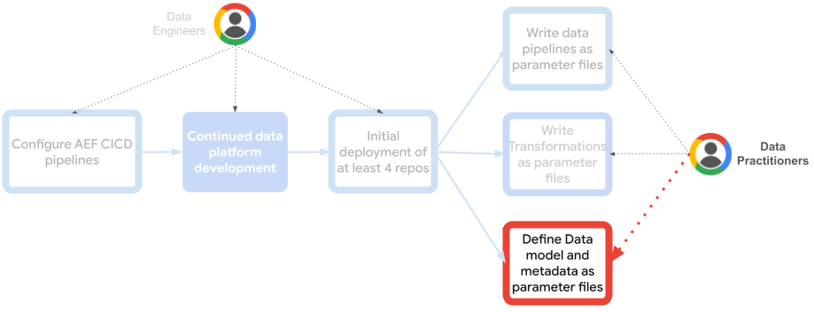

# Analytics Engineering Framework - Data Model

***Note:*** For a comprehensive installation guide of all the AEF repositories together, please look [here](https://github.com/googlecloudplatform/aef-orchestration-framework/blob/main/AEF_DEPLOYMENT.md).

[Analytics engineers](https://www.getdbt.com/what-is-analytics-engineering) lay the foundation for others to organize, transform, and document data using software engineering principles. Providing easy to use data platforms that empower data practitioners to independently build data pipelines in a standardized and scalable way, and answer their own data-driven questions.

This repository is designed for managing your data models (BigQuery, BigLake, etc.) and deploying them from various sources (SQL files, Dataform repositories, etc.). Additionally, it facilitates defining and deploying Dataplex metadata (lakes, zones, assets, annotations, policy tags, etc.). 

While usable independently, this tool is optimized as a component within a comprehensive Analytics Engineering Framework comprising:

1. [Orchestration Framework](https://github.com/googlecloudplatform/aef-orchestration-framework): Maintained by Analytics Engineers to provide seamless, extensible orchestration and execution infrastructure.
1. **(This repository) Data Model**: Directly used by end data practitioners to manage data models, schemas, and Dataplex metadata.
1. [Data Orchestration](https://github.com/googlecloudplatform/aef-data-orchestration): Directly used by end data practitioners to define and deploy data pipelines using levels, threads, and steps.
1. [Data Transformation](https://github.com/googlecloudplatform/aef-data-transformation): Directly used by end data practitioners to define, store, and deploy data transformations.



### Concepts
This reference Data Model management repository is your central hub for streamlined data model definition. It deploys dataform repositories and integrates with BigQuery metadata and [Dataplex](https://cloud.google.com/dataplex) to enable data governance, discoverability, and access control. Here's what it offers:
  - Creates or references Dataform repositories form given [third-party Git repositories](https://cloud.google.com/dataform/docs/connect-repository).
  - Creates or references BigQuery datasets based on given parameters or the variables you have in the [dataform settings files](https://cloud.google.com/dataform/docs/configure-dataform) like `dataform.json` you have in Dataform repositories.
  - Creates or references GCS buckets containing DDLs.
  - Creates or references GCS data buckets.
  - Creates Dataplex lakes and zones and register data assets (GCS buckets or BigQuery Datasets) accordingly based on given parameters.
  - Defines tag templates, policy taxonomies, governance rules and annotations to be applied to data assets based on given [parameter files](https://cloud.google.com/cortex/docs/datamesh#metadata_resources).


### Referenced Dataform Repositories
If your data model includes datasets referenced in Dataform repositories, you can choose to create those datasets as part of this data model deployment. To do so, set the Terraform variable ***create_dataform_repositories*** to ```true```. This controls whether the Dataform scripts found in the repositories will be created alongside other Terraform resources. If set to false, Dataform repositories should be created as an additional step in your CI/CD pipeline.

If you decide to use this repository to create datasets referenced in your Dataform repositories, define those datasets in the ***dataform.json*** file using the following format:
```json lines
{
  ...
  "vars": {
    "dataset_id_<DATASET_IDENTIFIER>":"<YOUR_DATASET_NAME>",
    "dataset_projectid_<DATASET_IDENTIFIER>":"<YOUR_DATASET_PROJECT>",
    "dataset_location_<DATASET_IDENTIFIER>":"<YOUR_DATASET_LOCATION>",
    ...
  }
}
```

## Usage

### 1. Dataplex:
   - Familiarize yourself with [this](https://cloud.google.com/cortex/docs/datamesh-concepts) concepts.
   - Define metadata in the following `.yaml` files:
     - [Asset Annotations](https://cloud.google.com/cortex/docs/datamesh#asset_annotations)
     - Dataplex [Lakes](https://cloud.google.com/cortex/docs/datamesh#Dataplex-Lakes), Zones, and Assets
     - [Policy Taxonomies and Tags](https://cloud.google.com/cortex/docs/datamesh#policy_taxonomies_and_tags)
     - [Data Catalog Tag Templates](https://cloud.google.com/cortex/docs/datamesh#catalog_tag_templates)
```
└── metadata
│   ├── annotations
│   │   └── annotations.yaml
│   ├── lakes
│   │   └── lakes.yaml
│   ├── policy_taxonomies
│   │   └── policy_taxonomies.yaml
│   └── tag_templates
│       └── tag_templates.yaml
```

### 2. Terraform:
While this repository can be used to keep track of your data model and metadata, the provided terraform code can be used to control deployment or just to reference it, so you can deploy it as another step in your CI/CD pipeline.

Define your terraform variables.  It is recommended creating a `.tfvars` file.
<!-- BEGIN TFDTFOC -->
| name                                                             | description                                                                                                                                                                                                                                                           | type                                               | required | default |
|------------------------------------------------------------------|-----------------------------------------------------------------------------------------------------------------------------------------------------------------------------------------------------------------------------------------------------------------------|----------------------------------------------------|----------|---------|
| [include_metadata_in_tfe_deployment](terraform/variables.tf#L16) | Controls whether metadata is deployed alongside Terraform resources. If false Metadata can be deployed as a next step in a CICD pipeline.                                                                                                                               | bool                                                   | false    | -       |
| [overwrite_metadata](terraform/variables.tf#L22)                 | Whether to overwrite existing Dataplex (Cortex Datamesh) metadata.                                                                                                                                                                                                    | string                                                 | true     | false    |
| [create_dataform_datasets](terraform/variables.tf#L29)           | Controls whether the datasets found in the dataform.json files in the repositories will be created alongside Terraform resources. If false datasets should be created otherwise.                                                                                          | bool                                                   | false    | -       |
| [create_ddl_buckets_datasets](terraform/variables.tf#L35)        | Controls whether the datasets referenced in the GCS DDL buckets will be created alongside Terraform resources. If false datasets should be created otherwise.                                                                                                           | bool                                                   | false    | -       |
| [create_dataform_repositories](terraform/variables.tf#L41)       | Controls whether the dataform scripts found in the repositories will be created alongside Terraform resources. If false dataform repositories should be created as an additional step in the CICD pipeline.                                                                  | bool                                                   | false    | -       |
| [compile_dataform_repositories](terraform/variables.tf#L47)      | Controls whether the dataform scripts found in the repositories will be compiled alongside Terraform resources. If false dataform repositories should be compiled as an additional step in the CICD pipeline.                                                               | bool                                                   | false    | -       |
| [execute_dataform_repositories](terraform/variables.tf#L53)      | Controls whether the dataform scripts found in the repositories will be executed alongside Terraform resources. If false dataform repositories should be executed as an additional step in the CICD pipeline.                                                                 | bool                                                   | false    | -       |
| [domain](terraform/variables.tf#L59)                             | Your organization or domain name, organization if centralized data management, domain name if one repository for each data domain in a Data mesh environment.                                                                                                             | string                                                 | true     | -       |
| [project](terraform/variables.tf#L65)                            | Project where the the dataform repositories, the Dataplex metadata, and other resources will be created.                                                                                                                                                            | string                                                 | true     | -       |
| [region](terraform/variables.tf#L71)                             | Region where the datasets from the dataform.json files, the dataform repositories, the Dataplex metadata, and other resources will be created.                                                                                                                           | string                                                 | true     | -       |
| [dataform_repositories](terraform/variables.tf#L77)              | Dataform repository remote settings required to attach the repository to a remote repository.                                                                                                                                                                        | map(object({...}))                                     | false    | {}      |
| [dataform_repositories_git_token](terraform/variables.tf#L87)    | Git token to access the dataform repositories, it will be stored as a secret in secret manager, and it will be used to connect and read the dataform.json to create the datasets.                                                                                       | string (sensitive)                                     | true     | -       |
| [create_data_buckets](terraform/variables.tf#L94)                | Controls whether the referenced data buckets will be created. If false referenced buckets should exist.                                                                                                                                                              | bool                                                   | false    | -       |
| [data_buckets](terraform/variables.tf#L100)                      | Data buckets.                                                                                                                                                                                                                                                           | map(object({...}))                                     | false    | {}      |
| [create_ddl_buckets](terraform/variables.tf#L113)                | Controls whether the referenced buckets containing DDLs will be created. If false referenced buckets should exist.                                                                                                                                                        | bool                                                   | false    | -       |
| [run_ddls_in_buckets](terraform/variables.tf#L119)               | Controls whether the .sql files in the referenced DDL buckets should be run.                                                                                                                                                                                          | bool                                                   | false    | -       |
| [ddl_buckets](terraform/variables.tf#L125)                       | Buckets containing .sql DDL scripts to be executed on Terraform deploy, It can be of flavors: bigquery, TODO                                                                                                                                                               | map(object({...}))                                     | false    | {}      |
<!-- END TFDOC -->

#### Example 

```hcl
    project = "<PROJECT_ID>"
    region  = "<REGION>"
    domain  = "<BUSINESS_DOMAIN_NAME>"
    
    include_metadata_in_tfe_deployment = true
    
    create_dataform_repositories    = true
    compile_dataform_repositories   = true
    execute_dataform_repositories   = true
    create_dataform_datasets        = true
    dataform_repositories_git_token = "<GIT_TOKEN>"
    dataform_repositories           = {
      sample-repo-1 = {
        remote_repo_url = "<GIT_HUB_REPOSITORY_URL>"
        secret_name     = "<SECRET_NAME>"
      },
      ...
    }
    
    create_data_buckets = false
    data_buckets        = {
      data-bucket-1 = {
        name          = "<DATA_BUCKET_NAME>"
        region        = "<DATA_BUCKET_REGION>"
        project       = "<DATA_BUCKET_PROJECT_ID>"
        dataplex_lake = "<DATA_BUCKET_LAKE_NAME>"
        dataplex_zone = "<DATA_BUCKET_ZONE_NAME>"
      },
      ...
    }
    
    create_ddl_buckets  = false
    run_ddls_in_buckets = true
    ddl_buckets         = {
      ddl-bucket-1 = {
        bucket_name          = "<DDL_BUCKET_NAME>"
        bucket_region        = "<DDL_BUCKET_REGION>"
        bucket_project       = "<DDL_BUCKET_PROJECT_ID>"
        ddl_flavor           = "bigquery"
        ddl_project_id       = "<PROJECT_ID_TO_REPLACE_IN_DDL_FILES>"
        ddl_dataset_id       = "<DATASET_ID_TO_REPLACE_IN_DDL_FILES>"
        ddl_data_bucket_name = "<DATA_BUCKET_NAME_TO_REPLACE_IN_DDL_FILES>"
        ddl_connection_name  = "<CONNECTION_NAME_TO_REPLACE_IN_DDL_FILES>"
      }, 
      ...
    }
```

#### Run Terraform Plan / Apply using the variables you defined.
```bash
terraform plan -var-file="prod.tfvars"
```